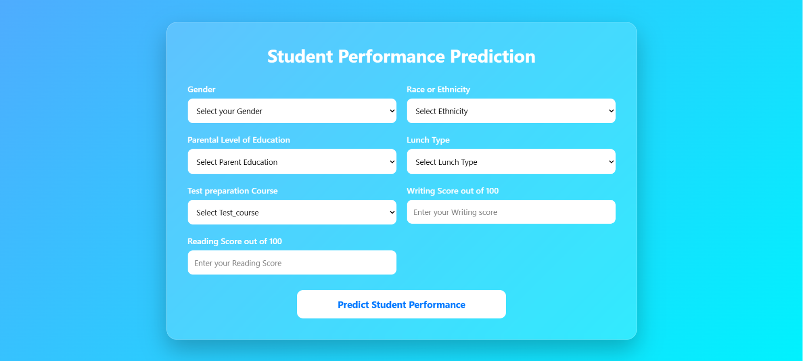

# 🎓 Student Performance Prediction | End-to-End ML Project

An **End-to-End Machine Learning Project** that predicts a student's **Mathematics Score** using demographic and academic information. This project demonstrates the complete Machine Learning workflow—from data preprocessing and model training to deployment as a web application using **Flask**.


---

## 🌐 Live Demo

🚀 **Live Application** (Deployed on Render)

🔗 https://student-performance-prediction-3ovu.onrender.com/

---

## 📖 Project Overview

Student academic performance is influenced by multiple demographic and academic factors such as parental education, lunch type, test preparation course, reading score, and writing score.

This project builds an end-to-end Machine Learning pipeline to predict a student's **Mathematics Score**. It includes data preprocessing, feature engineering, model comparison, hyperparameter tuning, model serialization, and deployment as an interactive Flask web application.

---

## ✨ Features

- 📊 Exploratory Data Analysis (EDA)
- 🔄 Data Preprocessing Pipeline
- 🤖 Multiple Regression Models
- 🎯 Hyperparameter Tuning
- 🌐 Flask Web Application
- 📝 Logging & Custom Exception Handling
- 📦 Modular Project Structure
- 🚀 Live Deployment on Render

---

## 📂 Project Structure

```text
Student-Performance-Prediction
│
├── artifacts/
│   ├── model.pkl
│   └── preprocessor.pkl
│
├── notebook/
│   ├── 1. EDA STUDENT PERFORMANCE.ipynb
│   └── 2. MODEL TRAINING.ipynb
│
├── src/
│   ├── components/
│   │   ├── data_ingestion.py
│   │   ├── data_transformation.py
│   │   └── model_trainer.py
│   │
│   ├── pipeline/
│   │   └── predict_pipeline.py
│   │
│   ├── exception.py
│   ├── logger.py
│   └── utils.py
│
├── static/
│   └── favicon.png
|   └── home.png
│
├── templates/
│   └── home.html
│
├── app.py
├── requirements.txt
├── setup.py
├── Dockerfile
└── README.md
```

---

## 📊 Dataset

The project uses the **Student Performance Dataset**, which contains the following features:

- Gender
- Race / Ethnicity
- Parental Level of Education
- Lunch Type
- Test Preparation Course
- Reading Score
- Writing Score

### 🎯 Target Variable

- Mathematics Score

---

## 🤖 Regression Models Evaluated

The following regression algorithms were trained and compared:

- Linear Regression
- Decision Tree Regressor
- Random Forest Regressor
- Gradient Boosting Regressor
- AdaBoost Regressor
- XGBoost Regressor
- CatBoost Regressor

The best-performing model is automatically selected after hyperparameter tuning using **R² Score**.

---

## ⚙️ Machine Learning Pipeline

### 📥 Data Ingestion

- Load Dataset
- Train-Test Split
- Store Training & Testing Data

### 🔄 Data Transformation

- Handle Categorical Features
- One-Hot Encoding
- Feature Scaling
- Column Transformer Pipeline

### 🏋️ Model Training

- Train Multiple Regression Models
- Hyperparameter Tuning
- Model Evaluation using R² Score
- Save Best Performing Model

### 📈 Prediction

- Load Saved Model
- Accept User Inputs
- Predict Mathematics Score

---

## 🌐 Web Application

The Flask web application allows users to:

- Enter student information
- Predict Mathematics Score instantly
- View prediction results through a clean and responsive interface

---

## 📸 Application Preview

<p align="center">
    
</p>

---

## 💻 Tech Stack

- Python
- Flask
- Pandas
- NumPy
- Scikit-learn
- XGBoost
- CatBoost
- HTML
- CSS
- Render

---

## 📚 Key Learnings

During this project, I gained hands-on experience in:

- Building an End-to-End Machine Learning Pipeline
- Data Preprocessing using Scikit-learn Pipelines
- Feature Engineering
- Hyperparameter Tuning
- Model Evaluation
- Flask Web Application Development
- Modular Project Architecture
- Logging & Custom Exception Handling

---

## 👨‍💻 Author

**Aryan Jaiswal**

🎓 B.Tech Computer Science Engineering Student  
Madan Mohan Malaviya University of Technology (MMMUT), Gorakhpur

- GitHub: https://github.com/aryanjaiswal-454
- LinkedIn: https://www.linkedin.com/in/aryan5178/